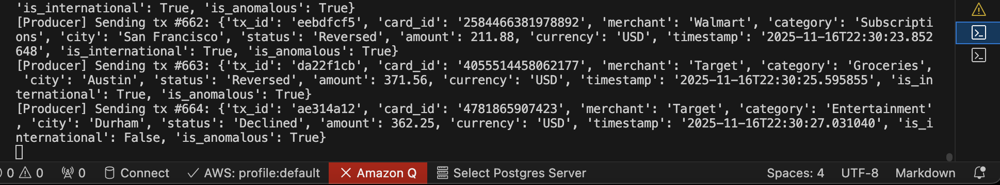
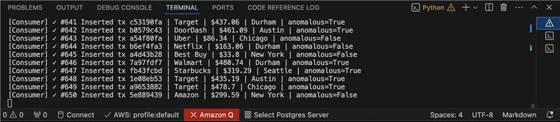

# Week 12 Real-Time Streaming System (Kafka + PostgreSQL + Streamlit)

## Overview

This project implements a full real-time data streaming pipeline built with **Apache Kafka**, **Python producers/consumers**, **PostgreSQL**, and a **real-time Streamlit dashboard**. Instead of e-commerce orders from the class demo, our version streams **synthetic credit‑card transactions** to mimic a real financial data feed.

The system shows how real‑time ingestion, persistence, and visualization work together in a modern streaming architecture.

---

## Screenshots

### 1. Producer Sending Credit Card Transactions


### 2. Kafka Consumer Inserting into PostgreSQL


### 3. Real-Time Dashboard (Auto-refreshing)
#### Dashboard – KPIs


#### Dashboard – Charts


# 1. System Architecture

The pipeline includes four main components:

### **1. Producer (Credit Card Events Generator)**

* Continuously generates synthetic credit‑card transactions.
* Produces messages to Kafka topic `orders_json`.
* Each event includes: `transaction_id`, `merchant`, `location`, `amount`, `timestamp`, `risk_flag`, etc.
* Runs every 0.5–2 seconds to simulate a real stream.

### **2. Kafka Broker**

* Single Kafka broker running in Docker (KRaft mode).
* Acts as the real-time message backbone.
* Stores and distributes messages to consumers.
* Topic used: **`orders_json`**.

### **3. Consumer (Ingest → PostgreSQL)**

* Subscribes to the `orders_json` topic.
* Converts Kafka messages into validated JSON.
* Inserts each transaction into a PostgreSQL table.
* Includes error‑handling and `ON CONFLICT DO NOTHING` to prevent duplicates.

### **4. Streamlit Dashboard (Real‑Time UI)**

* Auto-refreshing KPI dashboard.
* Pulls data directly from PostgreSQL.
* Shows:

  * Total transactions
  * Total value
  * Per‑merchant trends
  * Geo breakdown
  * Transaction volume charts
  * Real‑time list of latest transactions

---

# 2. How the Data Flows (End‑to‑End)

1. **Producer.py** creates a synthetic credit‑card transaction.
2. Sends JSON → **Kafka topic `orders_json`**.
3. **Consumer.py** reads the message from Kafka.
4. Consumer validates + inserts into **PostgreSQL**.
5. **dashboard.py** queries the database every few seconds.
6. UI updates live with new metrics and charts.

This satisfies the "Data Flow Integration" rubric in a clear, observable loop.

---

# 3. Running the System (Step‑by‑Step)

Below is the intuitive runbook for instructors or TAs.

## **Step 0 — Create and activate virtual environment**

```bash
python3.11 -m venv .venv
source .venv/bin/activate
pip install -r requirements.txt
```

## **Step 1 — Start Docker Services**

(Starts Kafka + Postgres)

```bash
docker-compose up -d
```

Verify:

```bash
docker ps
```

Should show:

* `kafka` on port **9094**
* `postgres` on port **5434**

## **Step 2 — Create Kafka Topic**

```bash
docker exec -it kafka kafka-topics \
  --create --topic orders_json \
  --bootstrap-server localhost:9094 \
  --partitions 1 --replication-factor 1
```

Verify:

```bash
docker exec -it kafka kafka-topics --list --bootstrap-server localhost:9094
```

## **Step 3 — Start Consumer (Terminal 1)**

```bash
python consumer.py
```

Expected output:

```
[Consumer] ✓ Connected to Kafka
[Consumer] ✓ Connected to PostgreSQL
[Consumer] Listening for messages...
```

## **Step 4 — Start Producer (Terminal 2)**

```bash
python producer.py
```

You should see:

```
[Producer] Sending transaction #0 {...}
[Producer] ✓ Sent to partition 0 at offset 0
```

## **Step 5 — Start Dashboard (Terminal 3)**

```bash
streamlit run dashboard.py
```

Dashboard auto-updates every 2–10 seconds.

---

# 4. Database Schema (Persistence Layer)

Created automatically by `consumer.py`:

```sql
CREATE TABLE IF NOT EXISTS orders (
    order_id VARCHAR(50) PRIMARY KEY,
    status VARCHAR(50),
    category VARCHAR(50),
    value NUMERIC(10, 2),
    timestamp TIMESTAMP,
    city VARCHAR(100),
    payment_method VARCHAR(50),
    discount NUMERIC(4, 2)
);
```

This table supports:

* Idempotent inserts
* Fast indexing by primary key
* Clean time-series queries for the dashboard

---

# 5. Rubric Coverage (Explicit Mapping)

Below is how this project satisfies every rubric section.

### ✅ **Producer Implementation (10 pts)**

* Producer generates synthetic credit‑card transactions.
* Runs indefinitely with random timing.
* JSON serialization + retry logic.

### ✅ **Kafka Configuration & Streaming (10 pts)**

* Kafka running in Docker (KRaft).
* Topic creation included.
* Proper advertised listeners.
* Producer + consumer connect successfully.

### ✅ **Consumer Functionality (10 pts)**

* Subscribes to `orders_json`.
* Uses a safe deserializer.
* Inserts validated rows into PostgreSQL.
* Includes error handling + skipping bad messages.

### ✅ **Database Schema & Persistence (10 pts)**

* PostgreSQL table created automatically.
* Uses `ON CONFLICT DO NOTHING`.
* Proper data types for analytics.

### ✅ **Data Flow Integration (10 pts)**

* End‑to‑end: producer → Kafka → consumer → database → dashboard.
* All components run independently + integrate through Kafka/Postgres.

### ✅ **Real-Time Dashboard Operation (15 pts)**

* Auto-refreshes.
* Visual KPIs (totals, averages, conversion rate).
* Category/City distribution charts.
* Shows last 10 events live.

### ✅ **Creativity & Modifications (20 pts)**

We diverged from the default project:

* **New domain:** real-time *credit-card transactions*.
* Included additional fields (risk flag, merchant types, etc.).
* Improved error-handling in consumer.
* Dashboard filters, limits, and custom KPIs.

### ⚡ Bonus (Optional)

If desired, this project could extend with:

* Flink streaming analytics (windowing, rolling metrics)
* Anomaly detection (fraud probability)
* Merchant segmentation
* Real-time alerting

---

# 6. Troubleshooting

**Kafka connection timeout**

```bash
docker-compose down -v
docker-compose up -d
```

**No records in dashboard**

* Is the consumer running?
* Check DB:

```bash
docker exec -it postgres psql -U kafka_user -d kafka_db -c "SELECT COUNT(*) FROM orders;"
```

**Module not found**: activate venv

```bash
source .venv/bin/activate
```

---

# 7. Conclusion

This project demonstrates the complete workflow of a modern real-time streaming system:

* High-throughput ingestion (Kafka)
* Scalable event generation (Producer)
* Reliable persistence (PostgreSQL)
* Live visualization (Streamlit)

It is a production-style architecture simplified for learning—but extensible for real analytics, fraud detection, and high-frequency data pipelines.